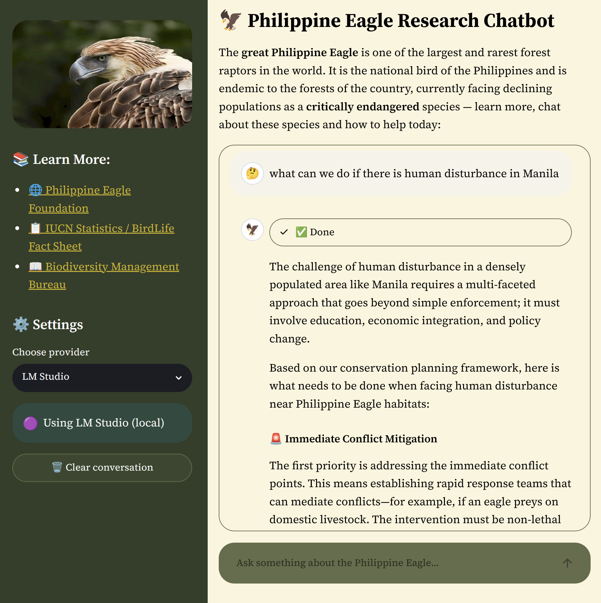
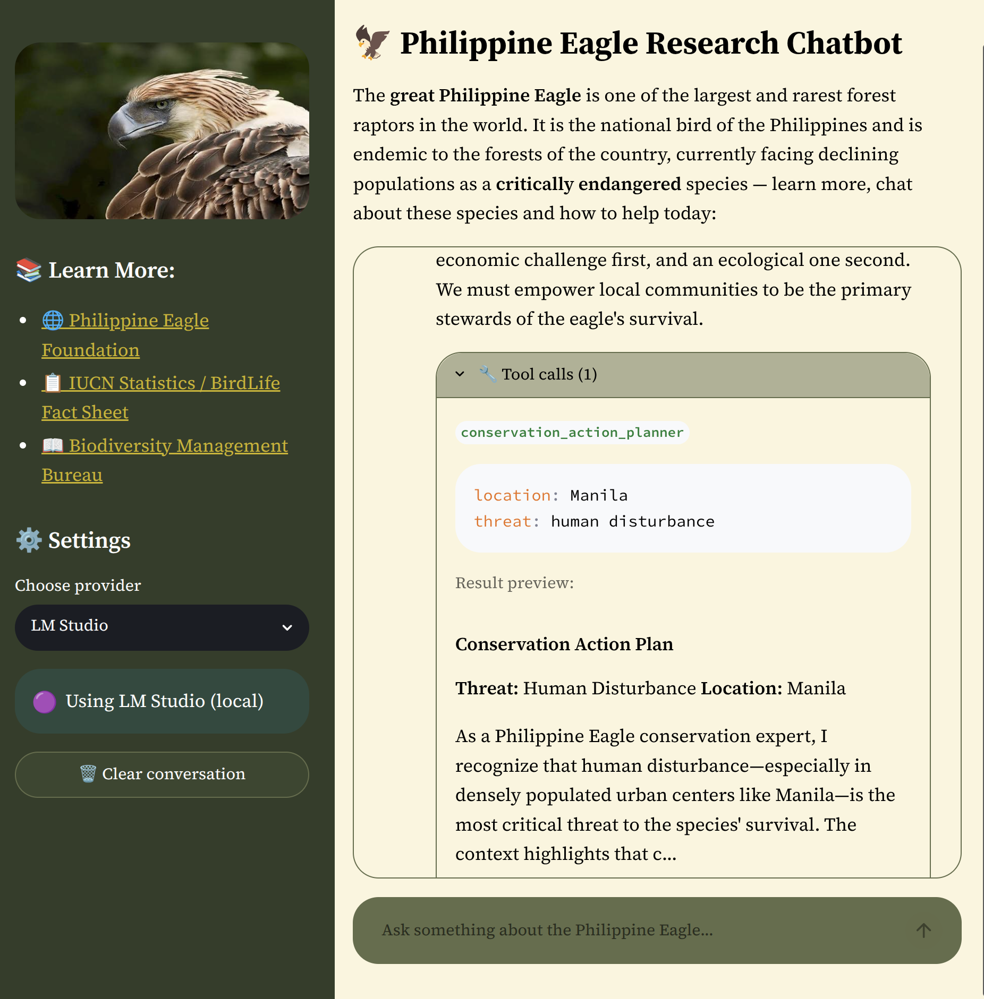

# 🦅 Philippine Eagle Conservation Research - an RAG-grounded LLM Agentic Chatbot
**Tech Stack:** Python, LangChain, OpenRouter, Streamlit, ChromaDB, HuggingFace

This repo provides an **agentic Retrieval-Augmented Generation (RAG) LLM research assistant** to help conservationists plan, and for any user to learn more, about the **great Philippine Eagle** - the critically endangered national bird of the Philippines. 

Powered by a **curated vector database** of peer-reviewed research, conservation fact sheets, and a handful of recent news articles. Equipped with **tools** - from citation sourcing, live IUCN status calling, to conservation planning across immediate to long-term timelines. Also includes a small **RAG evaluation pipeline** using the faithfulness metric to assess how well generated responses remain supported by retrieved evidence. Meant as an **accessible AI assistant** for researchers, conservationists, students, or the general public to learn more and take action to help with Philippine Eagle conservation. 


<div align="center">
  
</div>

### Features:
- 🧠 Agentic LLM with tools:
  - Citation Sourcing
  - Conservation Planning
  - Population Viability Estimator
  - Latest IUCN Species Status
- 🔍 **Multi-Query Retrieval-Augmented Generation (RAG)** for improved document recall
- 🤖 **Multi-Model support** with 5 total options:
  - (1 Local option) Supports local LLMs on LM Studio using Gemma 4
  - (4 Cloud options) OpenRouter options of free / paid OpenAI, Google, and NVIDIA models
- 📚 Pre-built **ChromaDB vector database** populated with research publications, conservation fact sheets, and curated news articles
- 🗂️ Semantic search powered by HuggingFace embeddings
- 📖 Grounded, citation-backed responses to reduce hallucinations
- 📊 RAG evaluation pipeline using DeepEval's Faithfulness metric to measure grounding quality
- 💬 Interactive Streamlit web interface with comprehensive visualizations

#### 🛠️ Tools

| Tool | Description | Params | Example Prompt |
|---|---|---|---|
| `search_eagle_knowledge` | Searches the Philippine Eagle knowledge base using RAG and returns relevant information with cited sources | `query: str` | "What is the conservation status of the Philippine Eagle?" |
| `estimate_population_viability` | Calculates a viability score from population parameters and generates an expert interpretation grounded in the knowledge base. `threat_level` must be one of: `low`, `medium`, `high`, `critical` | `breeding_pairs: int, habitat_hectares: float, threat_level: str` | "There are only 8 breeding pairs left in 1200 hectares with a high threat level — how viable is this population?" |
| `get_iucn_status` | Fetches the **latest IUCN Red List status** and brief status summary for the species **using the IUCN v4 taxon API endpoint**. Returns taxonomic information, Red List category, assessment history, and population trend. | None (fixed species: Pithecophaga jefferyi) | "Get the IUCN status of the Philippine Eagle" / simply "status" |

<div align="center">
  
  
</div>

#### Other features:
- Structured Pydantic Schema Output
- Security with input validation against prompt injection, revealing eagle sanctuary locations, etc.
- Rate limiting, API key management
- Error handling and error messages
- Logs and monitoring

#### 🛣️ Feature Roadmap:
- [ ] Add more to the RAG database
- [ ] Expand usage of IUCN Red List's API to give a more comprehensive species status snapshot > simple species status and date
- [ ] **More conservationist scientific tools** - Implement more tools that are use-case specific and practical for the day-to-day of conservationists; more science-based like the Population Viability Analysis tool
- [ ] Evaluate all metrics of RAG (Context relevancy, etc.)  not just faithfulness
- [ ] **`ingest.py`** - for learning, logging, and viewing purposes the RAG database was built in a notebook `RAG-base.ipynb`. Simple improvement to transfer it to a more typical `ingest.py`
- [ ] Test cases and unit testing for all tools
- [ ] Fix UI and improve aesthetics
- [ ] Possible to launch on the cloud for release
- [ ] Cleaner RAG - parsed PDFs, webpages vary in exported quality
- [ ] Contextual Compression Retriever may yield more relevant chunk retrieval from the RAG 

### Limitations
* ⚠️ Data Limitations
    * Most complete public data, last newsletters and annual reports made publicly available by the Philippine Eagle Foundation, were last published 2023 (Last Annual Report - 2021)
* Uses mini / lower-capacity models - model selection is limited for cost-effective API calling measures. 


## 📦 Libraries & Tools Used

*Most important project files can be found in the `src` folder that contains the streamlit app, system prompts, etc.*

### Tech Stack:
- Python
- Streamlit - UI dashboard used for front-end
- ChromaDB - vector database
- HuggingFace - embeddings
- LM Studio - Local inference for open-source models
- OpenAI Python SDK + OpenRouter API - unified client for OpenAI + OpenRouter LLM calls
- DeepEval - RAG evaluation

### 🔎 Viewing / Installation 

- **Viewing Option:** For general viewing, simply go through this README and the demo images.

- **Full Installation Option:** To run or develop the project locally:

1. Clone the repository:
   ```
   git clone https://github.com/giddygarcia/philippine-eagle-rag-agent.git
   cd philippine-eagle-rag-agent
   ```
2. Install dependencies with `uv`:
    ```
    uv sync
    ```
3. Run the application:
    ```
    uv run streamlit run src/app.py
    ```


## ✉️ Author and Contact Information
Developed by: Christine Garcia 

Have questions? Feel free to:
* email me at cavgarcia22@gmail.com 
* connect on [LinkedIn](www.linkedin.com/in/cavgarcia) 
* or [view more projects](https://github.com/giddygarcia) that I enjoyed making